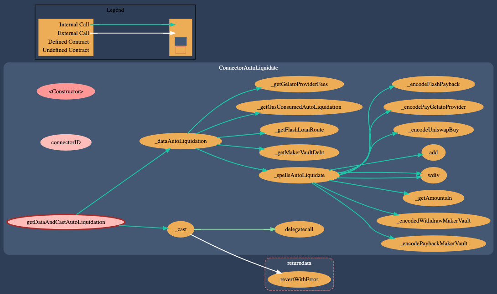
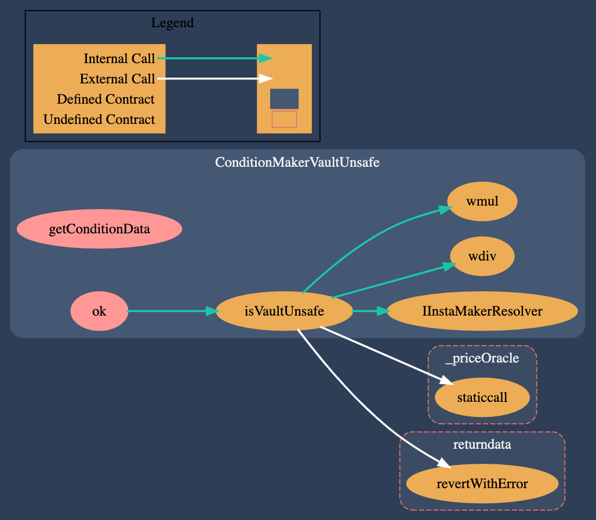

# DSA Auto Liquidator

This repo contains smart contracts, mocks and a test suite showcasing how to automate the execution (or casting) of auto liquidations in MakerDAO Vaults using InstaDapp DSAs and Gelato. The condition/recipe can be easily transformed and adapted to use other user proxy wallets (e.g DSProxy). There's also an UI provided to simulate the execution.

## Starting from scratch

- Install deps: `npm install`
- Compile SC: `npm run compile`
- Generate types of already deployed contracts used: `npm run typechain:deployed`
- Set `ALCHEMY_API_KEY` in `.env` file.

### Run tests

- `npm run test`
- [extra] - `npm run test:gas` (executes a mock to get an overview of gas usage)

### Run app

To run the app smoothly we will need to run a hardhat node which forks mainnet.

- Run node: `npm run mainnet:fork https://eth-mainnet.alchemyapi.io/v2/<ALCHEMY_API_KEY>`
- With the node running deploy condition and connectors: `npm run deploy:connectorsAndCondition`

Then:

- Navigate to the [apps](app) folder: `cd app`
- Install deps: `npm install`
- Build the app: `npm run build`
- Start the app: `npm run start`

Trouble shooting: If you are having trouble sending txs to the node, check the the node logs, it may be complaining about nonce. You may need to override the nonce on MetaMask.

## High level overview

The motto is very simple. We provide a task to Gelato via DSA to auto liquidate the position if the underlined condition is met. Flash loans are used to automate the process, Uniswap is used to exchange tokens and the fees are paid with the collateralized token.

In this flow are used several existent DSA connectors and are introduced new ones, such as [ConnectorAutoLiquidation](contracts/connectors/ConnectorAutoLiquidation.sol) and [ConditionMakerVaultUnsafe](contracts/conditions/ConditionMakerVaultUnsafe.sol) (originally taken from [here](https://github.com/gelatodigital/gelato-instadapp)). See graph of both below.

## References

- [InstaDapp Docs](https://docs.instadapp.io)
- [DSA Connectors](https://github.com/InstaDApp/dsa-connectors)
- [Gelato Docs](https://docs.gelato.network/)
